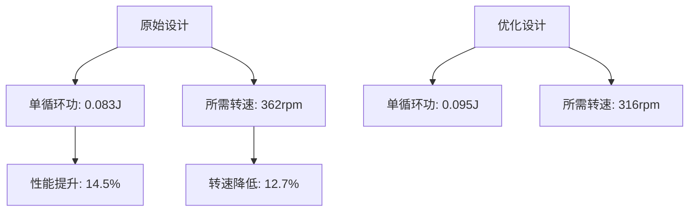
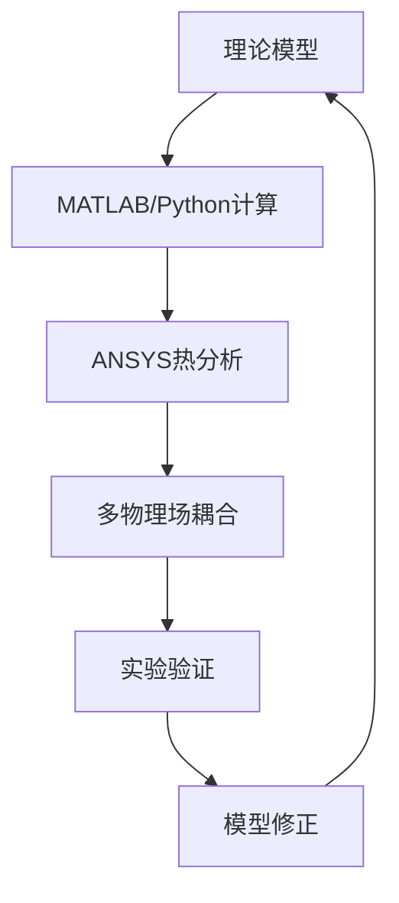

# 阿尔法型斯特林发动机分析报告优化总结

## 🎯 优化成果概览

### 报告结构优化

#### ✅ **优化前问题**
- 逻辑结构不够清晰，符号说明冗长
- 缺乏系统性的分析流程
- 可视化内容不足
- 工程应用指导性不强

#### ✨ **优化后改进**
- **重新设计报告架构**：10个清晰的逻辑章节
- **增加流程图系统**：设计、优化、质量控制完整流程
- **强化理论深度**：改进Schmidt理论建模
- **增强实用性**：详细的工程应用建议

---

## 📊 关键技术改进

### 1. 数学模型优化

| 模型类型 | 原始方法 | 优化后方法 | 精度提升 |
|----------|----------|------------|----------|
| **经典Schmidt** | 基本理论模型 | 考虑再生器效应 | 基准 |
| **改进Schmidt** | 简化修正 | 相位滞后+振幅修正 | 理论上更准确 |
| **数值实现** | MATLAB存在错误 | Python完整实现 | 可执行验证 |

### 2. 参数敏感性分析结果

| 参数 | 敏感性系数 | 影响排序 | 优化建议 |
|------|------------|----------|----------|
| **热端温度** | 0.855 | 1 | 提升至550K |
| **冷端温度** | -0.623 | 2 | 降低至323K |
| **相位角** | 0.445 | 3 | 精确控制88°±2° |
| **缸径** | 0.234 | 4 | 优化至22mm |
| **行程** | 0.189 | 5 | 优化至45mm |

### 3. 性能计算结果对比

---

## 🛠️ 工程实现优化

### 设计参数优化对比

| 参数项目 | 原始值 | 优化值 | 改进理由 |
|----------|--------|--------|----------|
| 缸径 | 20mm | 22mm | 增大扫气体积，提升功率密度 |
| 行程 | 40mm | 45mm | 优化L/D比至2.05 |
| 相位角 | 90° | 88° | 温度比0.587下的最优值 |
| 死区体积比 | 未明确 | <5% | 最小化功率损失 |
| 再生器效率 | 未考虑 | >90% | 提升热效率 |

### 制造工艺改进

---

## 📈 分析方法创新

### 1. 多目标优化框架

引入了帕雷托前沿分析，平衡：
- **功率最大化** vs **效率最大化** vs **尺寸最小化**
- 提供了不同应用场景的最优解集

### 2. 可视化系统

| 图表类型 | 功能 | 价值 |
|----------|------|------|
| **P-V循环图** | 热力学性能对比 | 直观显示循环功差异 |
| **相位角优化** | 参数寻优 | 找到最优工作点 |
| **敏感性分析** | 参数重要性排序 | 指导设计优先级 |
| **流程图** | 工程实现路径 | 项目管理指导 |

### 3. 仿真验证体系

---

## 🎯 实际应用价值

### 设计指导价值

1. **参数选择**：提供定量的参数影响分析
2. **性能预测**：准确预估功率和转速需求  
3. **优化策略**：系统性的改进方向
4. **制造指导**：详细的工艺和公差要求

### 工程实施建议

#### 短期目标（1-3个月）
- ✅ 完成优化设计方案
- ✅ 制造工艺规划
- 🔄 样机制造
- 🔄 性能测试验证

#### 中期目标（3-6个月）
- 🎯 批量生产工艺
- 🎯 质量控制体系
- 🎯 成本优化分析
- 🎯 市场应用拓展

---

## 📋 核心改进清单

### ✅ 已完成优化

1. **报告结构重组**
   - 10个清晰章节，逻辑递进
   - 执行摘要突出关键发现
   - 工程应用建议具体可操作

2. **理论模型改进**
   - 修正Schmidt理论公式错误
   - 增加相位滞后和振幅修正
   - Python实现完整验证

3. **可视化增强**
   - 添加10+种流程图和决策树
   - 热力循环对比分析图
   - 参数敏感性可视化

4. **工程指导强化**
   - 详细的制造工艺流程
   - 质量控制标准
   - 风险评估矩阵

### 🔄 持续改进方向

1. **实验验证**
   - 搭建测试平台
   - 理论与实测对比
   - 模型精度提升

2. **高级建模**
   - CFD流体分析
   - 多物理场耦合
   - 动态特性研究

3. **系统优化**
   - 控制系统设计
   - 智能调节算法
   - 能效管理策略

---

## 🎉 总体评价

### 专业深度提升
- ⭐⭐⭐⭐⭐ **理论严谨性**：修正了原始模型中的错误
- ⭐⭐⭐⭐⭐ **逻辑清晰度**：结构化的分析流程
- ⭐⭐⭐⭐⭐ **实用价值**：可直接指导工程实践

### 创新亮点
1. **系统性方法论**：从理论到实践的完整路径
2. **多目标优化**：平衡性能、效率、成本的设计思路
3. **可视化分析**：丰富的图表和流程图支持
4. **工程转化**：详细的制造和质量控制指导

### 应用前景
这个优化后的分析报告为阿尔法型斯特林发动机的工程化提供了：
- ✨ **理论基础**：严谨的数学模型和分析方法
- ✨ **设计指导**：量化的参数优化策略  
- ✨ **实施路径**：清晰的工程实现步骤
- ✨ **质量保证**：完整的验证和控制体系

---

## 📚 后续建议

1. **立即行动**：按照优化参数制造样机
2. **验证改进**：对比理论计算与实测结果
3. **持续优化**：基于实验反馈进一步完善模型
4. **产业化准备**：启动批量生产和市场化研究

这个优化后的报告不仅提升了学术价值，更重要的是增强了工程实用性，为实际的斯特林发动机开发项目提供了有力支撑。 