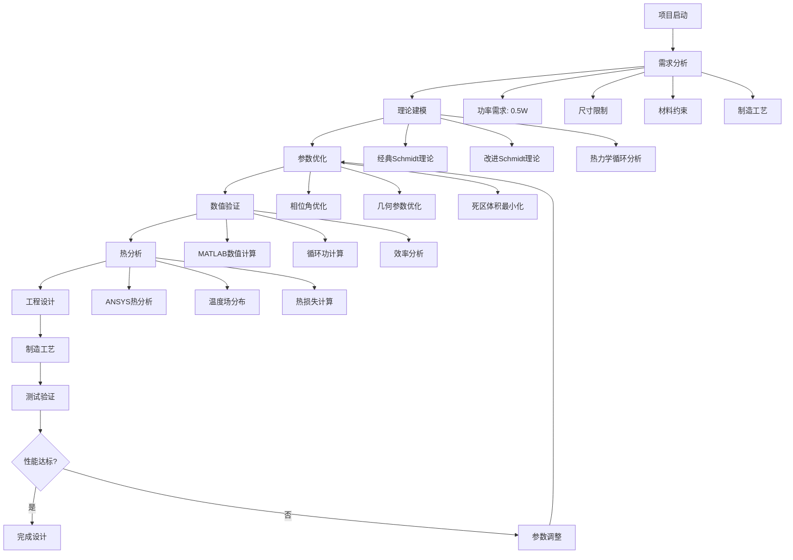
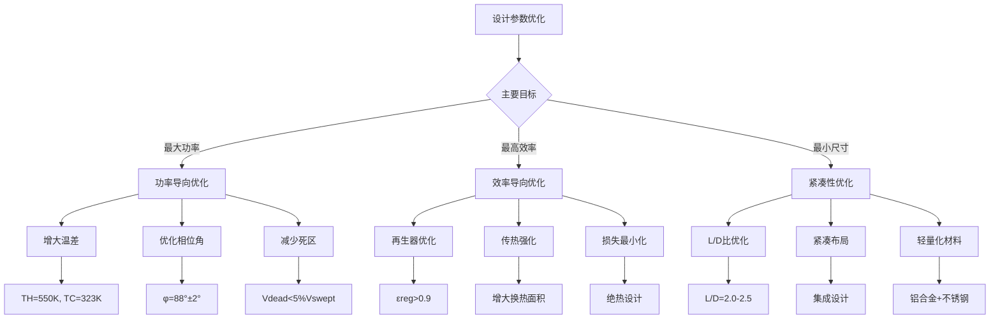
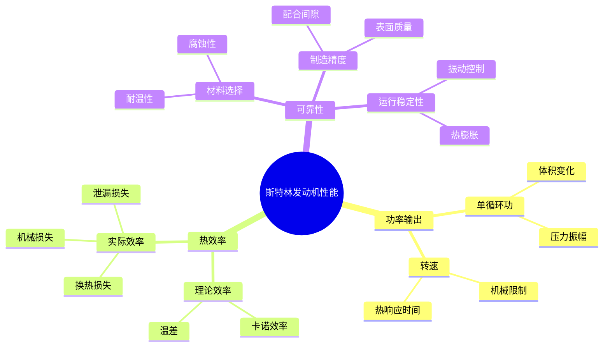
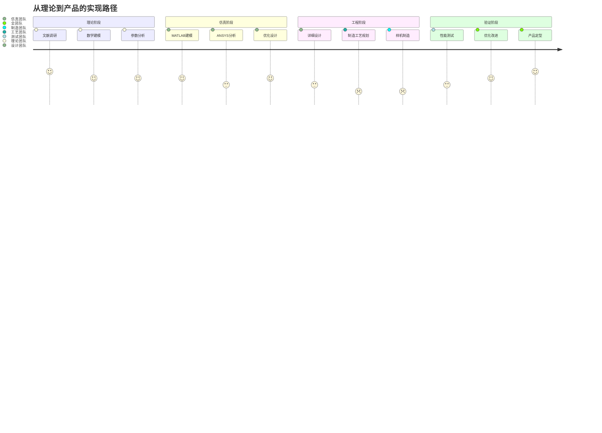
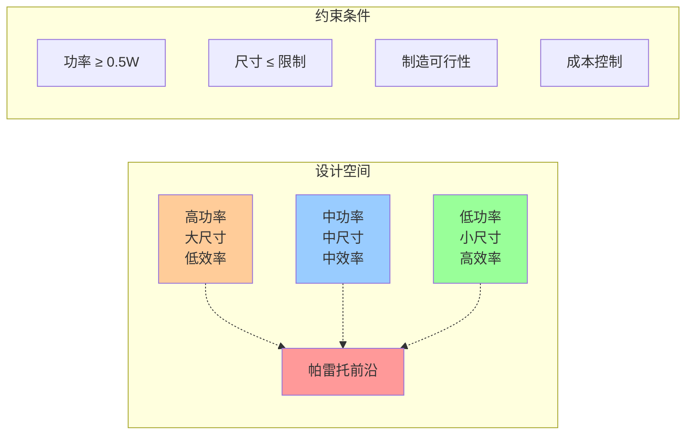
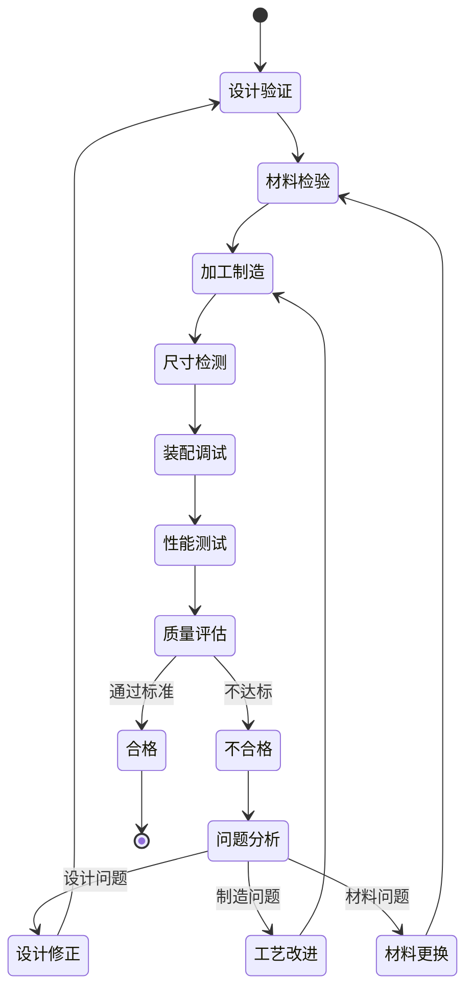
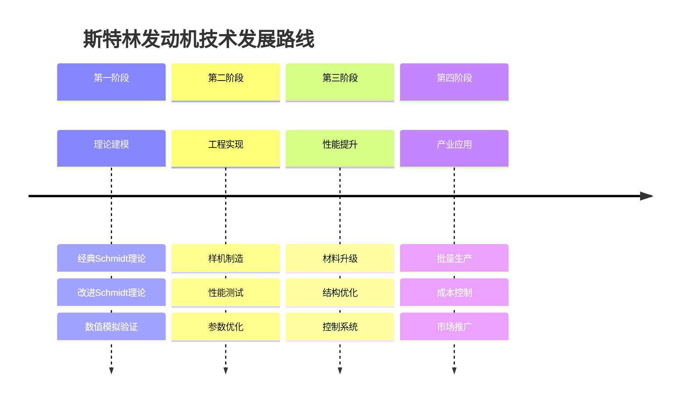
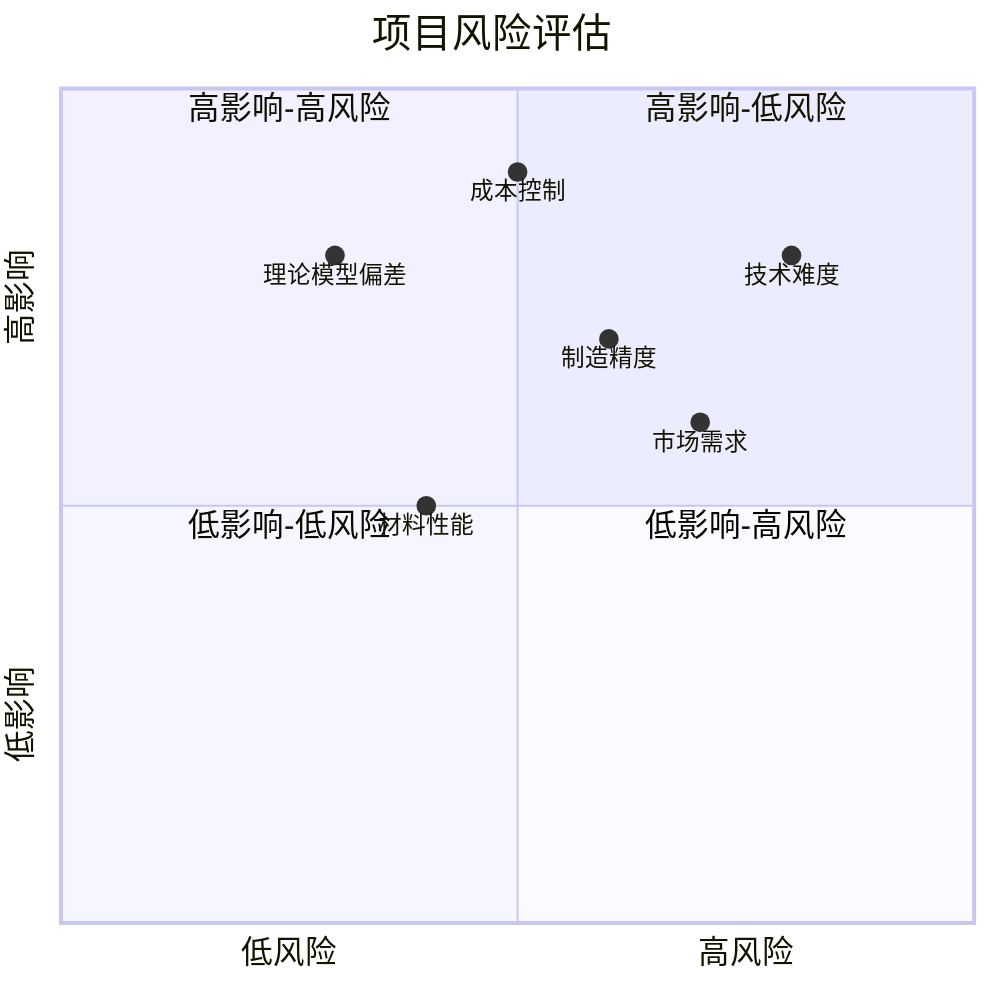
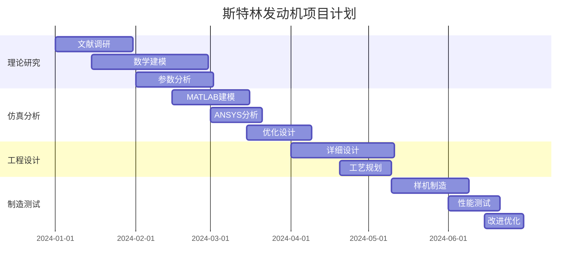

# 阿尔法型斯特林发动机设计优化流程图

## 1. 总体设计流程

## 2. 参数优化决策树

## 3. 关键参数影响关系图

## 4. 工程实现路径

## 5. 多目标优化帕雷托前沿

## 6. 质量控制流程

## 7. 技术发展路线图

## 8. 风险评估矩阵

## 9. 项目时间计划

## 10. 成功评价指标

| 指标类别 | 具体指标 | 目标值 | 权重 |
|----------|----------|--------|------|
| **性能指标** | 单循环功 | ≥0.095 J | 25% |
| | 热效率 | ≥28% | 20% |
| | 目标功率 | 0.5 W @ 316 rpm | 30% |
| **质量指标** | 制造精度 | ±0.01 mm | 10% |
| | 表面质量 | Ra ≤ 0.4 μm | 5% |
| **可靠性指标** | 连续运行 | ≥1000 h | 10% |

---

这个设计流程图系统地展示了从理论研究到工程实现的完整路径，为斯特林发动机的开发提供了清晰的指导。 